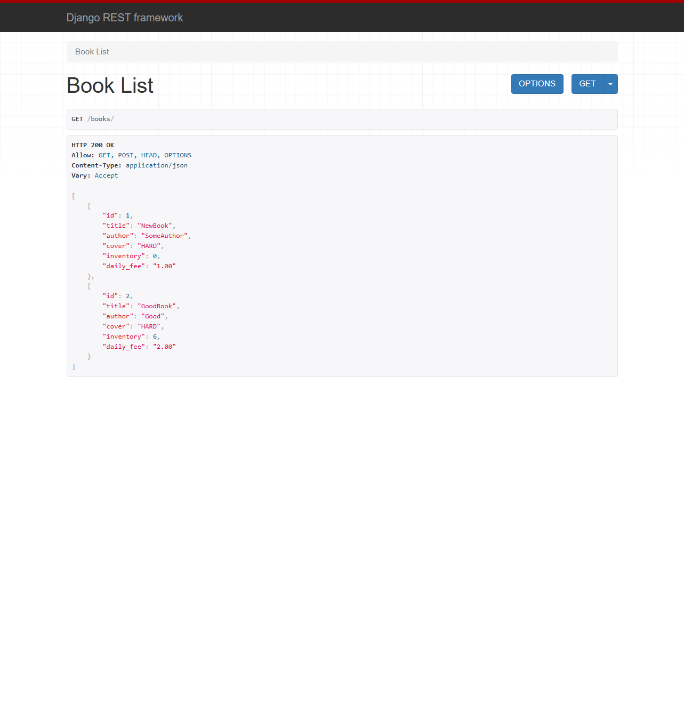

# Library Service


## Description
This project upgrades the library system, enabling users to borrow books and pay in cash based on reading duration. It replaces outdated manual tracking with an online management system, improving efficiency, inventory visibility, and user experience.


## Technologies Used
- Python
- Django ORM
- Django
- DRF


## Features
- API with Books data
- Borrowing feature
- Filtering Borrowings list


## Setup
To install the project locally on your computer, execute the following commands in a terminal:
```bash
git clone https://github.com/Illya-Maznitskiy/library-service.git
cd library-service
python -m venv venv
venv\Scripts\activate (on Windows)
source venv/bin/activate (on macOS)
pip install -r requirements.txt
```


## Commands to test the project:
You can run the tests and check code style using `flake8` with the following commands:

```
python manage.py test
flake8
```


## Access
To create a superuser, use the following command:

```bash
python manage.py createsuperuser
```
After creating the superuser, you can log in using these credentials on the /user/token/ page to get your authentication token. This token can be used for authorized access to the Library API.


## API Endpoints
### Documentation
- **GET:** `docs/`             - Access Swagger UI documentation
- **GET:** `download_docs/`    - Download the API schema

### Books Service
- POST: **`books/`**             - Add a new book
- GET: **`books/`**              - Get a list of books
- GET: **`books/<id>/`**         - Get book detail info 
- PUT/PATCH: **`books/<id>/`**   - Update book (also manage inventory)
- DELETE: **`books/<id>/`**      - Delete book

### Users Service
- POST: **`users/`**                          - Register a new user 
- POST: **`users/token/`**                   - Get JWT tokens 
- POST: **`users/token/refresh/`**           - Refresh JWT token 
- GET: **`users/me/`**                        - Get my profile info 
- PUT/PATCH: **`users/me/`**                  - Update profile info

### Borrowing Service
- **POST:** `borrowings/`                      - Add new borrowing (inventory should be decremented by 1)
- **GET:** `borrowings/?user_id=...&is_active=...`  - Get borrowings by user ID and whether the borrowing is still active
- **GET:** `borrowings/<id>/`                  - Get specific borrowing 
- **POST:** `borrowings/<id>/return/`         - Set actual return date (inventory should be incremented by 1)


## Screenshots:
### Library Structure


### Trello Tasks


### Example of Browsable DRF page

